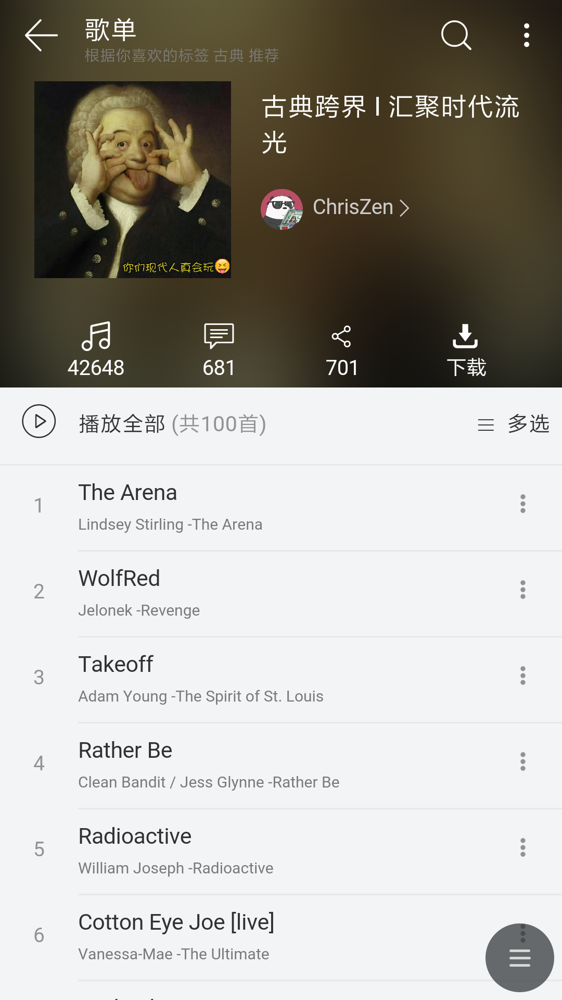
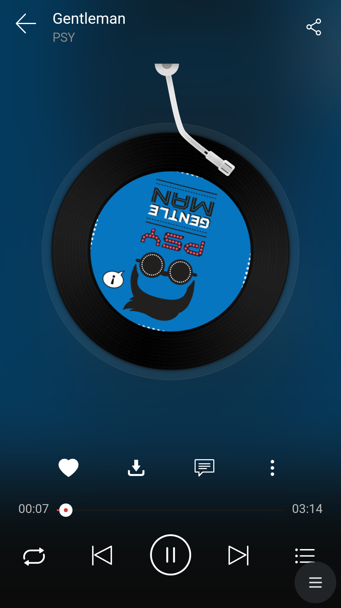

    
  

# 技术栈

> vue2.0 + vue-router + webpack + vuex + axios

> better-scroll (移动端滚动插件)

> fastclick (解决移动端click事件300ms延迟)

> vue-lazyload (图片懒加载)

> 后端采用基于node的网易云api接口

> 目前主要完成音乐播放和视频的播放, 搜索功能正在开发中.

# pc端浏览地址
> 如果觉得还可以，请star，你们的star是我前进的动力。

> 本项目正在不断更新中, 后续将添加更多的功能, 敬请期待.

> http://111.231.54.71:3000

# 更新历程

### 2 月 25 日更新 
添加播放器歌曲列表
### 2 月 26 日更新 
添加歌手详情信息页面
### 2 月 27 日更新 
完善搜索页面逻辑

# 项目截图

    
     
     
     
     
     
     
     

